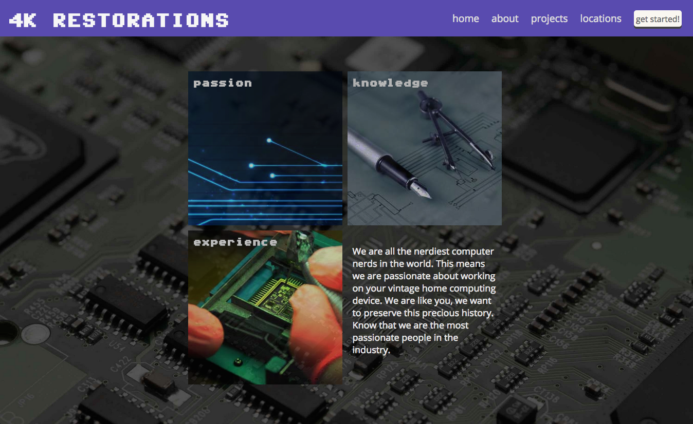
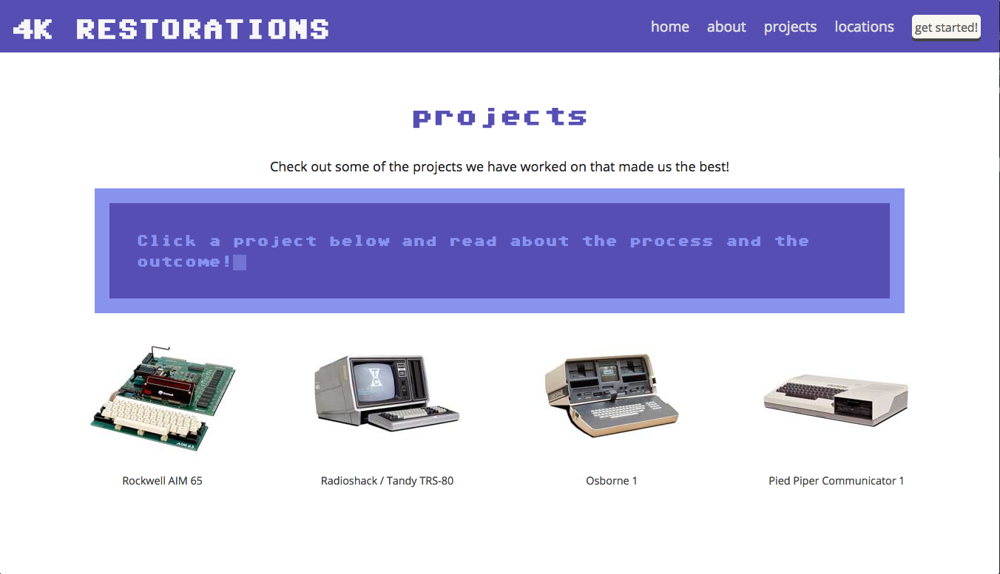
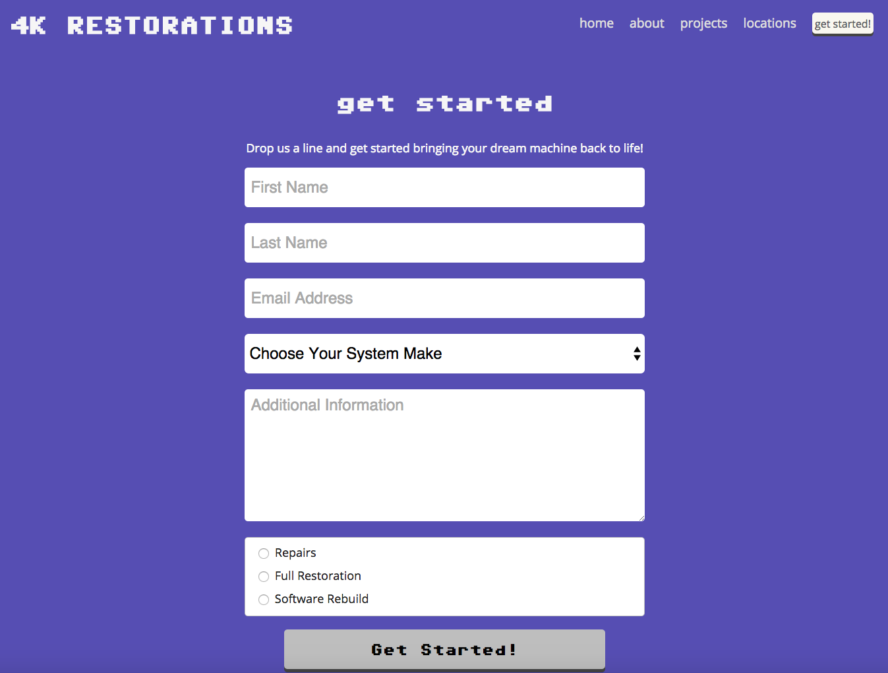

#4K Restorations
A fully responsive (mobile, tablet and desktop/laptop) website for a fictitious vintage computer restoration company.  The website is a basic marketing site for the company which plugs their capabilities, describes the main people who are behind the company, showcases some of the best projects that the company is proud of, and the ability to contact the company to start moving ahead on a new project.

##Website details
###Home


The home area is a place to describe to marketing plugs for the company including how passionionate the people are and how knowledgeable they are about the industry

**Technologies used** for this space are HTML/CSS for the layout and style, including CSS hovers with transition effects for opacity and hover fade in.  Also jQuery was used to dynically display blurbs for each marketing plug on hover using the data attribute to target the correct paragraph item

**Paragraph targeting function**
```
//show the marketing plugs on each mouse over
$('.imgblock').on('mouseenter', function() {
  var $thisID = $(this).data('plug');
  $('.blurb p').hide();
  $('#' + $thisID).fadeIn(400);
});
```

###About
The About section is where the company illustrates who the company leadership is that make everything possible.  They have three company officers that provide the knowledge and know how for the company.

**Technologies used** for this section of the website are mainly HTML, css and jQuery to target the proper employee bio paragraph and display the correct one on click.  Again, the `.data()` jQuery function was used.

###Projects


The projects section is one of the more fun parts of the website.  It is a list of four vintage computers that were worked on by the fictitious company.  Users can click or tap on any of the computer images and read about the project story in a vintage-looking computer console that is modeled after the default console of the Commodore 64.  The story is typed out on the screen by a blinking cursor.

**Technologies used** for this section are HTML/CSS and jQuery to allow the user to select the computer project and get the proper text blurb about the project.  Once again the `data()` jQuery method was used to get the correct item clicked on in order to display the correct text block. JavaScript `setTimeout()` was used to stagger the screen printing to simulate fast typing on the vintage Commodore computer console.

**JavaScript Typing Function**
```
app.typeDescription = function(msg) {
  //initialize counter
  var i = 0;
  //define text
  var text = msg;
  //reset the description screen
  $('.description .typer').html("");
  //text is split up to letters
  $.each(text.split(''), function(i, letter){

      //we add 20*i ms delay to each letter
      setTimeout(function(){

          //we add the letter to the container
          $('.description .typer').html($('.description .typer').html() + letter);

      }, 20 * i);
  });
}
```
###Locations
THe locations section is a simple Google Maps implementation.  The company has 4 fictitious locations in Chicago, LA, Las Vegas and New York.  The user is able to click on a tab that displays the location on the mape in each of the four cities.

**Technologies used** for this section are the HTML/CSS for design and layout, jQuery and JavaScript to create a data object for each city containing the location and marker data for the Google Map, and of course the Google Maps API to render the map with the appropriate location and marker to show the exact location of the business.   jQuery was once again used to determine which 'tab' button the user clicked and sends that data to the renderGoogleMap function to display the correct map location and marker.

**Rendering Google Map Function**
```
app.renderGoogleMap = function(location) {
  //draw first
  app.maps[location] = new google.maps.Map($('#mapCanvas')[0], app.mapOptions[location]);

  app.markers[location] = new google.maps.Marker({
      position: app.mapOptions[location].center,
      map: app.maps[location],
      title: '4K Restorations: ' + location
  });

  //set the marker on chicago location as default
  app.markers[location].setMap(app.maps[location]);
}
```
###Contact


Finally, the contact section is a place where prospective clients can connect with the company to allow them to start working on a new vintage computer restoration project.  The form is populated with a dropdown of popular vintage computers from the 70s, 80s and 90s via an API call to simulated RESTful API that is hosted on the site.

**Technologies Used** are HTML/CSS for the form and design, jQuery for the AJAX call to the API and finally JSON to simulate the data used in the form.  The AJAX call is a simple GET request to the JSON that loads all the data.  Then in JavaScript, all the elements are rendered into the form select as options via `jQuery.append()`

**Get & Write List of Vintage Computers Function**
```
app.getComputersList = function() {
  var ajaxData = {
    url: 'http://swimclan.github.io/project1/data/computers.json',
    type: 'GET',
    dataType: 'json',
    success: function(data) {
      for (var item in data) {
        console.log(data[item].system);
        $('#computer_model').append('<option>' + data[item].system + ' (' + data[item].year + ')</option>');
      }
    },
    error: function(err) {
      console.log(err);
    }
  }
  $.ajax(ajaxData);
}
```
##Future Directions
In the future we will be adding video to the site that shows some of the restoration process and interviews with satisfied customers.  Another direction that we will take is to add a directory of vintage computers with links to resllers for the collector enthusiasts that are out there. 
